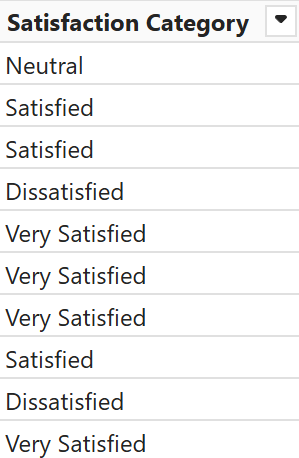

# Customer Satisfaction and Loyalty Analytics – OmniRetail

## 1. Introduction
This project analyzes customer satisfaction and loyalty at OmniRetail, a U.S. retail chain specializing in electronics and smart home products. The goal is to uncover insights from customer behavior, feedback, demographics, and regional data collected throughout 2024.

## 2. Problem Statement
Customer satisfaction and retention are critical for OmniRetail's growth. However, gaps in product experience, support accessibility, and demographic expectations have impacted loyalty. This project aims to identify key drivers of satisfaction and loyalty, locate dissatisfied segments, and provide actionable insights for improvement.

## 3. Skills Demonstrated
- Data modeling & transformation
- DAX calculations and KPIs
- Relationship and filter design
- Interactive visualizations
- Advance Bookmark navigation and UX design
- Insight storytelling based on user behavior

## 4. Data Sourcing
The project uses internally provided datasets from OmniRetail, covering:
- Customer feedback and satisfaction surveys
- Purchase behavior and loyalty segmentation
- Demographics (age, gender, group)
- Support interaction history
- Location data (city/state)

The Dataset Provide by **Onyx Data** 

More Information About This Challenge: [ Onyx Data July 2025 Challenge](https://zoomcharts.com/en/microsoft-power-bi-custom-visuals/challenges/onyx-data-july-2025)

## 5. Data Transformation
Power Query and DAX were used to:
- Clean and group age ranges
- Categorize satisfaction scores
- Normalize locations and support values
- Generate image URLs for satisfaction factor and Satisfaction Category
- Create calculated columns and measures (Total Customers, Repeat Buyers, Loyalty Level breakdown, and more)

  - Calculated Total and Average `Based Measure`

   

  - Rate %

   

  - Create New Columns for better Analysis `Age Category` & `Customer Satisfaction Category`
    
  | DAX | Result |
  |----------|----------|
  |  |  |

  | DAX | Result |
  |----------|----------|
  |  |  |

## 6. Modeling
Four tables were modeled with proper relationships with Star Schema Model:
- `fct_Customer Satisfaction` (fact table)
- `dim_Satisfaction Factor` (includes satisfaction image URLs)
- `dim_State` (geographical data)
- `dim_Satisfaction Category` (score grouping and image URL)

One-to-many relationships were established with single cross-filter direction for reliable filtering. Lookup tables supported dynamic KPI cards and image rendering.

 

## 7. Analyze & Visualization
Built using Power BI, the dashboard consists of **Three main pages** :

### Page 1 – Overview
**Key KPIs** : Total Customers, Average Satisfaction Score, Support Contact Rate, and Top Satisfaction Factor.

- Customer Demographic and distribution
- Satisfaction Score by Gender and Satisfaction Category

**Insights Covered**:
- *Critical Factors of Satisfaction*
  - Drivers of High Satisfaction (Score 9-10): 'Packaging' (8 customers), ‘Product Quality’ (4 customers), ‘Ease of Use’ (3 customers), and ‘Customer Service’ (3 customers) are the most frequently mentioned factors.
  - Causes of Dissatisfaction (Score 1-3): 'Ease of Use' (7 customers), 'Support Availability' (5 customers), 'Features' (5 customers), 'Brand Reputation' (5 customers), and 'Price' (5 customers) are the main causes. 
- *Customer Segments & Loyalty*
  - `Midlife` and `Pre-Retirement`have a higher proportion of ‘Low Loyalty’ compared to other age groups.
  - Group A anomaly: “High-frequency shoppers” (Group A) have 10 ‘Low Loyalty’ customers, which is almost equal to ‘Medium’ (9) and ‘High’ (9) loyalty, indicating that frequency of purchase does not necessarily equal loyalty. Group B (“Moderate-frequency”) is mostly low loyalty with 16 ‘Low Loyalty’ customers.
- *Geography*
  - Texas has the highest number of customers with 41, followed by California with 26.
- *Impact of Support Contacts*
  - `Customers Who Contact Support` Have an Average Satisfaction Score of ~4.98. Among them, there are 19 ‘Dissatisfied’ customers vs. 14 ‘Very Satisfied’.
  - `Customers Who Do Not Contact Support` Have an Average Satisfaction Score of ~4.48. Among them, there are 17 ‘Dissatisfied’ vs. 13 ‘Very Satisfied’ customers.
- *Repeat Buyer vs. New Buyer*
  - Repeat Buyers `(Purchase_History=‘Yes’)`: Average Satisfaction Score ~5.72.
  - One-Time/New Buyers `(Purchase_History=‘No’)`: Average Satisfaction Score ~4.98.
- *Demographic Factor Preferences*
  - Age: ‘Young Adults’ prioritize ‘Ease of Use’. 'Midlife' looks for ‘Product Variety’ & ‘Brand Reputation’. 'Pre-Retirement' focus on ‘Delivery Speed’, ‘Ease of Use’, and ‘Support Availability’.
  - Gender: Women value ‘Packaging’ more highly. Men focus on ‘Features’.
  - Group: 'Group A' (High frequency buyers) value ‘Customer Service’ & ‘Price’. 'Group B' (Medium frequency shoppers) prioritize ‘Delivery Speed’.

### Page 2 – Loyalty
- *Loyalty vs. Satisfaction*
  - High Loyalty: Average Satisfaction Score ~5.87 and only 16.67% ‘Dissatisfied’.
  - Low Loyalty: Average Satisfaction Score of ~4.98 and 40.48% ‘Dissatisfied’.
  - Medium Loyalty: Average Satisfaction Score of ~4.59 (lowest among all loyalty levels) and 33.33% ‘Dissatisfied’.
- *Geographical Anomalies (Hotspot & Coldspot)*
  - Satisfied & Loyal:
    - Illinois: Average Satisfaction Score of 7.0 (highest) with 0 ‘Dissatisfied’ customers.
    - New York: Average Satisfaction Score of 6.5, with 4 ‘High Loyalty’ customers.
  - Dissatisfied & Low Loyalty:
    - Texas: Average Satisfaction Score of 5.08 (lowest) with 10 ‘Dissatisfied’ customers and 12 ‘Low Loyalty’ customers (highest).
    - California: Average Satisfaction Score of 5.19 with 10 ‘Dissatisfied’ customers.
    - Arizona: Has 10 ‘Low Loyalty’ customers.
- *The Impact of “Price” and “Product Variety” on Loyalty*
  - 'Product Variety': If this is a satisfaction factor, 6 out of 11 customers are in the ‘Low Loyalty’ category.
  - 'Price': Of the 9 customers who mentioned price, the distribution was 2 ‘Low Loyalty’, 4 ‘Medium Loyalty’, and 3 ‘High Loyalty’, showing a varied impact.

### Page 3 – Detailed
Detailed analysis of Customers by geography, including State, Location, Customer Satisfaction breakdown.  This page provides insight into managing customer satisfaction.

You can interact with report here [Onyx Data](https://app.powerbi.com/view?r=eyJrIjoiYjJiNzU4ZTktNDlkZS00YmZlLWI2YTEtMTI5YmIyOTY1MzA1IiwidCI6IjQ2NTRiNmYxLTBlNDctNDU3OS1hOGExLTAyZmU5ZDk0M2M3YiIsImMiOjl9)

  

## 8. Conclusion
- Analysis of OmniRetail's 2024 customer satisfaction and loyalty data has revealed several critical areas and strategic opportunities. The main factors driving customer dissatisfaction are “Ease of Use,” “Support Availability,” “Features,” “Brand Reputation,” and “Price,” indicating fundamental problems in product experience and after-sales service. In contrast, “Packaging” and “Product Quality” are the main drivers of high satisfaction.

- Geographically, Illinois showed excellent satisfaction performance with zero dissatisfied customers, making it a model for best practices. On the other hand, Texas and California, particularly San Antonio, face significant satisfaction and loyalty challenges, with a high proportion of dissatisfied and low-loyalty customers.

- Loyalty analysis by segment shows that high purchase frequency (Group A) does not necessarily guarantee strong loyalty, with a significant proportion of low loyalty among them. Female customers also showed higher levels of low loyalty than males. Satisfaction factor preferences vary demographically: women value “Packaging”, men focus on “Features”, Group A is sensitive to “Customer Service” and ‘Price’, while Group B prioritizes “Delivery Speed”.

- Although repeat buyers are generally more satisfied than one-time buyers, the significant proportion of dissatisfaction among repeat buyers points to the need for continued attention to the post-purchase experience. The data also shows that loyalty does not always correlate perfectly with transactional satisfaction, indicating that other factors may be at play.

## 7. Recomendation
Based on these findings, OmniRetail can implement the following strategic recommendations to improve satisfaction and drive customer loyalty:

## 1. 🧩 Enhance Core Product Experience
**Action**: Conduct a UX audit focusing on "Ease of Use" and "Features", particularly for younger customers. Prioritize enhancements in product design and usability.

**Why**: These factors are major sources of dissatisfaction, especially among Young Adults and Early Midlife groups. Addressing them will build a strong foundation for improved satisfaction.

---

## 2. 🤝 Optimize Customer Service
**Action**: Provide intensive training to support teams and establish mechanisms for post-interaction feedback. Ensure support availability aligns with peak customer demand.

**Why**: Poor "Support Availability" and inconsistent service quality are key drivers of negative experiences. Enhancing support interactions can turn dissatisfaction into loyalty.

---

## 3. 🧠 Loyalty Program Recalibration by Segment
**Action**: 
- For **Group A (High Frequency, Low Loyalty)**: Personalize loyalty rewards to deepen brand connection.
- For **Group B (Medium Frequency)**: Focus on improving delivery reliability and speed.

**Why**: Group A shows a loyalty gap despite frequent purchases, indicating a weak emotional bond. Group B is highly influenced by delivery performance.

---

## 4. 🌍 Targeted Regional Improvements
**Action**: 
- Investigate low-performing regions (e.g., San Antonio, TX; broader Texas and California).
- Benchmark and replicate best practices from high-performing states like Illinois and New York.

**Why**: Satisfaction and loyalty are clustered geographically, indicating region-specific operational issues and opportunities for optimization.

---

## 5. 🛒 Refine Product Variety & Pricing Strategy
**Action**: 
- Expand product variety based on demand trends, especially for the Midlife segment.
- Adjust pricing strategies regularly and incorporate value-based loyalty offerings.

**Why**: Limited product variety and unclear pricing value are eroding loyalty. A data-backed assortment and pricing strategy will improve perceived value.

---

## 6. 🚚 Strengthen Post-Purchase Experience
**Action**: Improve delivery logistics, product quality assurance, and after-sales service.

**Why**: A sizable portion of repeat buyers still reports dissatisfaction, highlighting gaps in post-purchase touchpoints that threaten long-term retention.

---

> 📌 **Conclusion**: These targeted interventions, guided by behavioral segmentation and satisfaction trends, will allow OmniRetail to transform customer pain points into loyalty drivers and create a competitive advantage through customer-centric operations.

---

### Repository Contents  
- **Power BI Dashboard File**: The main [PBIX File](pbix_file.zip) containing the analysis and visualizations. 
- **Data Sources**: [Raw Dataset](raw_dataset.zip) used in the project.  
- **Screenshots/Reports**: Exported visualizations for sharing insights.  
- **README.md**: Project documentation (this file).
